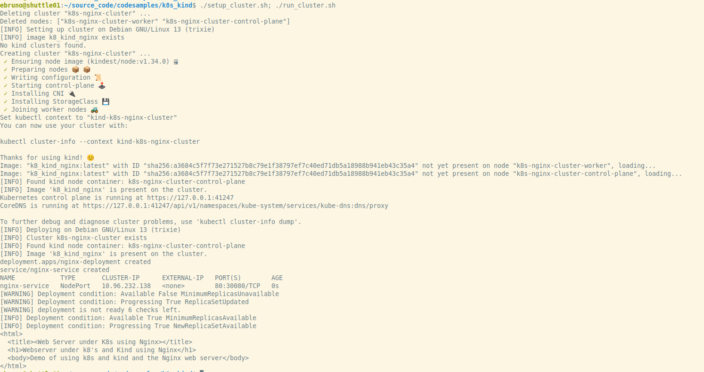

# K8s Demo #

Demostration of a nginx server using [kind](https://kind.sigs.k8s.io) and k8.

This has been tested on the following environments

 * Debian 12 requires kind, kubectl and docker to be installed on the system.
 * RHEL 10 requires kind, kubectl and podman to be installed on the system.

## Running the demo ##

	 ./setup_cluster.sh
	 ./run_cluster.sh

	 # When you are done.

	 ./cleanup.sh

Sample Run

