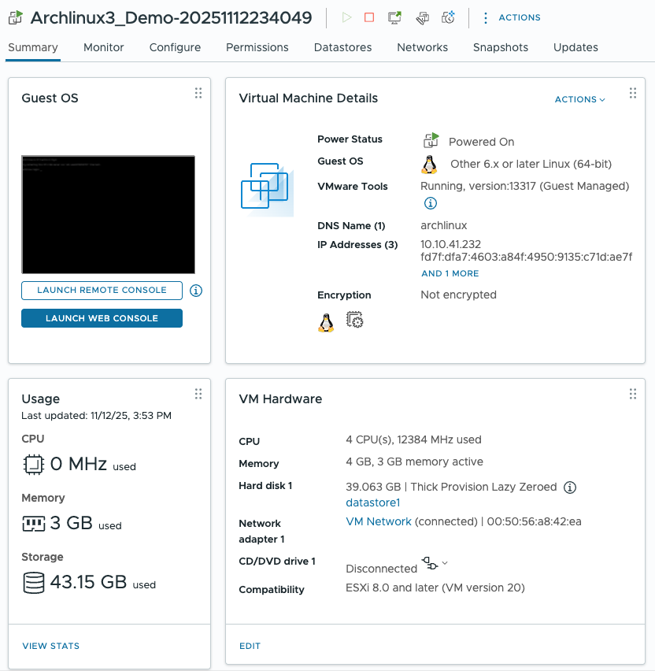

# Example builds for VMware using Packer #

Examples builds for VMware and VSphere
The templates were tested on:

  * Fedora 42 Server
  * MacOS X Tahoe 26.0.1

  VMware ESXi server 8.03
  VMware vCenter 8.03

The following examples are provided:

  * Fedora 42 direct to an ESXi server.
  * Fedora 42 to vSphere vCenter
  * Freebsd 14 to vSphere vCenter
  * ArchLinux 2025.11.01 to vSphere vCenter
  
  Note: Archlinux will automatically configure to use latest version based on date the create_archlinux.sh script is run.
  
  The examples are done slightly differently due to Operating systems and targets, demostrating the flexiablity of packer.

Packer documentation:

The VNware builder creates a virtual machine, installs an operating system from an ISO,
provisions software within the operating system, and then exports the virtual machine as an image.
This is best for those who want to start by creating an image for use with VMware desktop hypervisors:

  * VMware Fusion Pro
  * VMware Workstation Pro
  * VMware Workstation Player
  * VMware vSphere Hypervisor

Documentation:

  * [VMware ISO](https://developer.hashicorp.com/packer/integrations/hashicorp/vmware/latest/components/builder/iso)

The vSphere builder starts from a guest operating system ISO file and builds a virtual machine image on a
vSphere cluster or an ESXi host using the vSphere API.

Documentation:

  * [vSphere ISO](https://developer.hashicorp.com/packer/integrations/hashicorp/vsphere/latest/components/builder/vsphere-iso)

## Environment ##

It is required that packer and Broadcom VMware ovtool are installed on the system.

 * fedora42srv\_vmware.pkr.hcl  requires access to an ESXI Server
 * fedora42srv\_vsphere.pkr.hcl requires access to a vCenter instance.
 * freebsd14srv\_vsphere.pkr.hcl requires access to a vCenter instance.

It is also recommended to install Microsoft Powershell and VMware Powershell Extensions.

### MacOS ###

Instructions for installing packer, powershell, ovftool, VMWARE Powershell extensions can be found here:

 * [PACKER](https://developer.hashicorp.com/packer/tutorials/docker-get-started/get-started-install-cli)
 * [POWERSHELL](https://learn.microsoft.com/en-us/powershell/scripting/install/installing-powershell-on-macos?view=powershell-7.5)
 * [OVFTOOL](https://developer.broadcom.com/tools/open-virtualization-format-ovf-tool/latest)
 * [VMWARE_POWERSHELL](https://developer.broadcom.com/powercli/installation-guide)

You may need to issue the following powershell commands to complete the setup.

	Register-PSRepository -Default
	Set-PSRepository -Name PSGallery -InstallationPolicy Trusted
	Install-Module -Name VMware.PowerCLI -Scope CurrentUser
	
### Linux ###

Instructions for installing packer, powershell, ovftool, VMWARE Powershell extensions can be found here:

 * [PACKER](https://developer.hashicorp.com/packer/tutorials/docker-get-started/get-started-install-cli)
 * [POWERSHELL](https://learn.microsoft.com/en-us/powershell/scripting/install/installing-powershell-on-macos?view=powershell-7.5)
 * [OVFTOOL](https://developer.broadcom.com/tools/open-virtualization-format-ovf-tool/latest)
 * [VMWARE_POWERSHELL](https://developer.broadcom.com/powercli/installation-guide)

Depending on your Linux distribution the following package(s) may need to be installed ovftool to function:

  * sudo dnf install libnsl
  * sudo dnf install libxcrypt-compat

You may need to issue the following powershell commands to complete the setup.

	Register-PSRepository -Default
	Set-PSRepository -Name PSGallery -InstallationPolicy Trusted
	Install-Module -Name VMware.PowerCLI -Scope CurrentUser

It is suggested mkpasswd be installed to generate encrypted passwords.
mkpasswd may be in it's own package.

### How to get list of supported guestId's ###
Using powershell:

     # if you are using self signed certs execute this command
	 # Set-PowerCLIConfiguration -InvalidCertificateAction Ignore
	 Connect-VIServer -Server <vcenter server> -User <account>@<domain> -Password <password>
	 $anyEsxiHost = @(Get-VMHost) | Select-Object -First 1
	 $envBrowser = Get-View -Id (Get-View -Id $anyEsxiHost.ExtensionData.Parent).EnvironmentBrowser
	 $vmxVersion = ($envBrowser.QueryConfigOptionDescriptor() | Where-Object {$_.DefaultConfigOption}).Key
	 $envBrowser.QueryConfigOption($vmxVersion, $null).GuestOSDescriptor | Select-Object -Property Id, FullName
	 
	 Id                         FullName
	 --                         --------
	 amazonlinux3_64Guest       Amazon Linux 3 (64-bit)
	 amazonlinux2_64Guest       Amazon Linux 2 (64-bit)
	 almalinux_64Guest          AlmaLinux (64-bit)
	 rockylinux_64Guest         Rocky Linux (64-bit)
	 windows2022srvNext_64Guest Microsoft Windows Server 2025 (64-bit)
	 windows2019srvNext_64Guest Microsoft Windows Server 2022 (64-bit)
	 windows2019srv_64Guest     Microsoft Windows Server 2019 (64-bit)
	 windows9Server64Guest      Microsoft Windows Server 2016 (64-bit)
	 windows8Server64Guest      Microsoft Windows Server 2012 (64-bit)
	 windows7Server64Guest      Microsoft Windows Server 2008 R2 (64-bit)
	 winLonghorn64Guest         Microsoft Windows Server 2008 (64-bit)
	 winLonghornGuest           Microsoft Windows Server 2008 (32-bit)
	 winNetEnterprise64Guest    Microsoft Windows Server 2003 (64-bit)
	 winNetEnterpriseGuest      Microsoft Windows Server 2003 (32-bit)
	 winNetDatacenter64Guest    Microsoft Windows Server 2003 Datacenter (64-bit)
	 winNetDatacenterGuest      Microsoft Windows Server 2003 Datacenter (32-bit)
	 winNetStandard64Guest      Microsoft Windows Server 2003 Standard (64-bit)
	 winNetStandardGuest        Microsoft Windows Server 2003 Standard (32-bit)
	 winNetWebGuest             Microsoft Windows Server 2003 Web Edition (32-bit)
	 winNetBusinessGuest        Microsoft Small Business Server 2003
	 windows12_64Guest          Microsoft Windows (64-bit)
	 windows11_64Guest          Microsoft Windows 11 (64-bit)
	 windows9_64Guest           Microsoft Windows 10 (64-bit)
	 windows9Guest              Microsoft Windows 10 (32-bit)
	 windows8_64Guest           Microsoft Windows 8.x (64-bit)
	 windows8Guest              Microsoft Windows 8.x (32-bit)
	 windows7_64Guest           Microsoft Windows 7 (64-bit)
	 windows7Guest              Microsoft Windows 7 (32-bit)
	 winVista64Guest            Microsoft Windows Vista (64-bit)
	 winVistaGuest              Microsoft Windows Vista (32-bit)
	 winXPPro64Guest            Microsoft Windows XP Professional (64-bit)
	 winXPProGuest              Microsoft Windows XP Professional (32-bit)
	 win2000AdvServGuest        Microsoft Windows 2000
	 win2000ServGuest           Microsoft Windows 2000 Server
	 win2000ProGuest            Microsoft Windows 2000 Professional
	 winNTGuest                 Microsoft Windows NT
	 win98Guest                 Microsoft Windows 98
	 win95Guest                 Microsoft Windows 95
	 win31Guest                 Microsoft Windows 3.1
	 dosGuest                   Microsoft MS-DOS
	 vmwarePhoton64Guest        VMware Photon OS (64-bit)
	 crxPod1Guest               VMware CRX Pod 1 (64-bit)
	 crxSys1Guest               VMware Photon CRX (64-bit)
	 rhel9_64Guest              Red Hat Enterprise Linux 9 (64-bit)
	 rhel8_64Guest              Red Hat Enterprise Linux 8 (64-bit)
	 rhel7_64Guest              Red Hat Enterprise Linux 7 (64-bit)
	 rhel6_64Guest              Red Hat Enterprise Linux 6 (64-bit)
	 rhel6Guest                 Red Hat Enterprise Linux 6 (32-bit)
	 rhel5_64Guest              Red Hat Enterprise Linux 5 (64-bit)
	 rhel5Guest                 Red Hat Enterprise Linux 5 (32-bit)
	 rhel4_64Guest              Red Hat Enterprise Linux 4 (64-bit)
	 rhel4Guest                 Red Hat Enterprise Linux 4 (32-bit)
	 rhel3_64Guest              Red Hat Enterprise Linux 3 (64-bit)
	 rhel3Guest                 Red Hat Enterprise Linux 3 (32-bit)
	 rhel2Guest                 Red Hat Enterprise Linux 2.1
	 sles16_64Guest             SUSE Linux Enterprise 16 (64-bit)
	 sles15_64Guest             SUSE Linux Enterprise 15 (64-bit)
	 sles12_64Guest             SUSE Linux Enterprise 12 (64-bit)
	 sles11_64Guest             SUSE Linux Enterprise 11 (64-bit)
	 sles11Guest                SUSE Linux Enterprise 11 (32-bit)
	 sles10_64Guest             SUSE Linux Enterprise 10 (64-bit)
	 sles10Guest                SUSE Linux Enterprise 10 (32-bit)
	 sles64Guest                SUSE Linux Enterprise 8/9 (64-bit)
	 slesGuest                  SUSE Linux Enterprise 8/9 (32-bit)
	 centos9_64Guest            CentOS 9 (64-bit)
	 centos8_64Guest            CentOS 8 (64-bit)
	 centos7_64Guest            CentOS 7 (64-bit)
	 centos6_64Guest            CentOS 6 (64-bit)
	 centos6Guest               CentOS 6 (32-bit)
	 centos64Guest              CentOS 4/5 (64-bit)
	 centosGuest                CentOS 4/5 (32-bit)
	 debian12_64Guest           Debian GNU/Linux 12 (64-bit)
	 debian12Guest              Debian GNU/Linux 12 (32-bit)
	 debian11_64Guest           Debian GNU/Linux 11 (64-bit)
	 debian11Guest              Debian GNU/Linux 11 (32-bit)
	 debian10_64Guest           Debian GNU/Linux 10 (64-bit)
	 debian10Guest              Debian GNU/Linux 10 (32-bit)
	 debian9_64Guest            Debian GNU/Linux 9 (64-bit)
	 debian9Guest               Debian GNU/Linux 9 (32-bit)
	 debian8_64Guest            Debian GNU/Linux 8 (64-bit)
	 debian8Guest               Debian GNU/Linux 8 (32-bit)
	 debian7_64Guest            Debian GNU/Linux 7 (64-bit)
	 debian7Guest               Debian GNU/Linux 7 (32-bit)
	 debian6_64Guest            Debian GNU/Linux 6 (64-bit)
	 debian6Guest               Debian GNU/Linux 6 (32-bit)
	 debian5_64Guest            Debian GNU/Linux 5 (64-bit)
	 debian5Guest               Debian GNU/Linux 5 (32-bit)
	 debian4_64Guest            Debian GNU/Linux 4 (64-bit)
	 debian4Guest               Debian GNU/Linux 4 (32-bit)
	 opensuse64Guest            SUSE openSUSE (64-bit)
	 opensuseGuest              SUSE openSUSE (32-bit)
	 asianux8_64Guest           MIRACLE LINUX 8 (64-bit)
	 asianux7_64Guest           Asianux 7 (64-bit)
	 asianux4_64Guest           Asianux 4 (64-bit)
	 asianux4Guest              Asianux 4 (32-bit)
	 asianux3_64Guest           Asianux 3 (64-bit)
	 asianux3Guest              Asianux 3 (32-bit)
	 fedora64Guest              Red Hat Fedora (64-bit)
	 fedoraGuest                Red Hat Fedora (32-bit)
	 oesGuest                   Novell Open Enterprise Server
	 oracleLinux9_64Guest       Oracle Linux 9 (64-bit)
	 oracleLinux8_64Guest       Oracle Linux 8 (64-bit)
	 oracleLinux7_64Guest       Oracle Linux 7 (64-bit)
	 oracleLinux6_64Guest       Oracle Linux 6 (64-bit)
	 oracleLinux6Guest          Oracle Linux 6 (32-bit)
	 oracleLinux64Guest         Oracle Linux 4/5 (64-bit)
	 oracleLinuxGuest           Oracle Linux 4/5 (32-bit)
	 ubuntu64Guest              Ubuntu Linux (64-bit)
	 ubuntuGuest                Ubuntu Linux (32-bit)
	 coreos64Guest              CoreOS Linux (64-bit)
	 other6xLinux64Guest        Other 6.x or later Linux (64-bit)
	 other6xLinuxGuest          Other 6.x or later Linux (32-bit)
	 other5xLinux64Guest        Other 5.x Linux (64-bit)
	 other5xLinuxGuest          Other 5.x Linux (32-bit)
	 other4xLinux64Guest        Other 4.x Linux (64-bit)
	 other4xLinuxGuest          Other 4.x Linux (32-bit)
	 other3xLinux64Guest        Other 3.x Linux (64-bit)
	 other3xLinuxGuest          Other 3.x Linux (32-bit)
	 other26xLinux64Guest       Other 2.6.x Linux (64-bit)
	 other26xLinuxGuest         Other 2.6.x Linux (32-bit)
	 other24xLinux64Guest       Other 2.4.x Linux (64-bit)
	 other24xLinuxGuest         Other 2.4.x Linux (32-bit)
	 otherLinux64Guest          Other Linux (64-bit)
	 otherLinuxGuest            Other Linux (32-bit)
	 darwin23_64Guest           Apple macOS 14 (64-bit)
	 darwin22_64Guest           Apple macOS 13 (64-bit)
	 darwin21_64Guest           Apple macOS 12 (64-bit)
	 darwin20_64Guest           Apple macOS 11 (64-bit)
	 darwin19_64Guest           Apple macOS 10.15 (64-bit)
	 darwin18_64Guest           Apple macOS 10.14 (64-bit)
	 darwin17_64Guest           Apple macOS 10.13 (64-bit)
	 darwin16_64Guest           Apple macOS 10.12 (64-bit)
	 darwin15_64Guest           Apple Mac OS X 10.11 (64-bit)
	 darwin14_64Guest           Apple Mac OS X 10.10 (64-bit)
	 darwin13_64Guest           Apple Mac OS X 10.9 (64-bit)
	 darwin12_64Guest           Apple Mac OS X 10.8 (64-bit)
	 darwin11_64Guest           Apple Mac OS X 10.7 (64-bit)
	 darwin11Guest              Apple Mac OS X 10.7 (32-bit)
	 darwin10_64Guest           Apple Mac OS X 10.6 (64-bit)
	 darwin10Guest              Apple Mac OS X 10.6 (32-bit)
	 darwin64Guest              Apple Mac OS X 10.5 (64-bit)
	 darwinGuest                Apple Mac OS X 10.5 (32-bit)
	 freebsd14_64Guest          FreeBSD 14 or later versions (64-bit)
	 freebsd14Guest             FreeBSD 14 or later versions (32-bit)
	 freebsd13_64Guest          FreeBSD 13 (64-bit)
	 freebsd13Guest             FreeBSD 13 (32-bit)
	 freebsd12_64Guest          FreeBSD 12 (64-bit)
	 freebsd12Guest             FreeBSD 12 (32-bit)
	 freebsd11_64Guest          FreeBSD 11 (64-bit)
	 freebsd11Guest             FreeBSD 11 (32-bit)
	 freebsd64Guest             FreeBSD Pre-11 versions (64-bit)
	 freebsdGuest               FreeBSD Pre-11 versions (32-bit)
	 os2Guest                   IBM OS/2
	 netware6Guest              Novell NetWare 6.x
	 netware5Guest              Novell NetWare 5.1
	 solaris11_64Guest          Oracle Solaris 11 (64-bit)
	 solaris10_64Guest          Oracle Solaris 10 (64-bit)
	 solaris10Guest             Oracle Solaris 10 (32-bit)
	 solaris9Guest              Sun Microsystems Solaris 9
	 solaris8Guest              Sun Microsystems Solaris 8
	 openServer6Guest           SCO OpenServer 6
	 openServer5Guest           SCO OpenServer 5
	 unixWare7Guest             SCO UnixWare 7
	 eComStation2Guest          Serenity Systems eComStation 2
	 eComStationGuest           Serenity Systems eComStation 1
	 otherGuest64               Other (64-bit)
	 otherGuest                 Other (32-bit)
	 vmkernel8Guest             VMware ESXi 8.0 or later
	 vmkernel7Guest             VMware ESXi 7.x
	 vmkernel65Guest            VMware ESXi 6.x
	 vmkernel6Guest             VMware ESXi 6.0
	 vmkernel5Guest             VMware ESXi 5.x
	 vmkernelGuest              VMware ESX 4.x

## fedora42srv\_vmware.pkr.hcl ##

Variables:

 | Name                | Description  | Type | Default | Required | Adjust for deployment environment |
 |:--------------------|:-------------|:-----|:--------|:--------:|:--------------------:|
 | remote\_username    | User name for login | string | None | Yes | Yes |
 | remote\_password    | User password for login  | string | None | Yes | Yes |
 | esxi\_server        | esxi server IP/FQDN | string | None | Yes | Yes |
 | output\_directory"  | Output directory for VM artifacts |string | ./output-artifacts | Yes | Yes |
 | vm\_name            | Virtual Machine name to build  | string | Fedorasrv42\_Demo | Yes | Yes |

### Sample Run VMmare iso ###

	./cleanup.sh; packer build -force  fedora42srv_vmware.pkr.hcl >& log.txt

[Sample Fedora 42 VMware iso details](doc_md/fedora42_vmware_iso_details.md)

## fedora42srv\_vsphere.pkr.hcl ##

Variables:
 | Name                 | Description  | Type | Default | Required | Adjust for deployment environment |
 |:---------------------|:-------------|:-----|:--------|:--------:|:--------------------:|
 | remote\_username     | User name for login | string | None | Yes | Yes |
 | remote\_password     | User password for login  | string | None | Yes | Yes |
 | convert\_to\_template| Convert the virtual machine to a template after the build is complete. If set to true, the virtual machine can not be imported into a content library | bool | true | Yes | Yes |
 | datacenter           | Datacenter name | string | None | Yes | Yes |
 | esxi\_server         | esxi server IP/FQDN | string | None | Yes | Yes |
 | output\_directory    | Output directory for VM artifacts |string | ./output-artifacts | Yes | Yes |
 | vcenter\_server      | vCenter Server IP/FQDN | string | None | Yes | Yes |
 | vm\_name             | Virtual Machine name to build  | string | Fedorasrv42\_Demo | Yes | Yes |

### Sample Run vSphere iso ###

	./cleanup.sh; packer build -force  fedora42srv_vsphere.pkr.hcl >& log.txt

[Sample Fedora 42 vSphere iso detail](doc_md/fedora42_vsphere_iso_details.md)

## freebsd14srv\_vsphere.pkr.hcl ##

Variables:

 | Name                  | Description  | Type | Default | Required | Adjust for deployment environment |
 |:----------------------|:-------------|:-----|:--------|:--------:|:--------------------:|
 | remote\_username      | User name for login | string  | None  | Yes | Yes |
 | remote\_password      | User password for login  | string | None | Yes | Yes |
 | convert\_to\_template | Convert the virtual machine to a template after the build is complete. If set to true, the virtual machine can not be imported into a content library | bool | true | Yes | Yes |
 | datacenter            | vCenter datacenter to install VM | string | None | Yes | Yes |
 | esxi\_server          | esxi server IP/FQDN | string | None | Yes | Yes |
 | output\_directory     | Output directory for VM artifacts |string | ./output-artifacts | Yes | Yes |
 | root\_password\_enc   | VM's root password for login  | string | encypted string for the password 'packer' | Yes | Yes |
 | ssh\_password         | Plain text to for the ssh connection | string | packer | Yes | Yes |
 | ssh\_password_enc     | User name to for the ssh connection | string | packer | Yes | Yes |
 | ssh\_user             | User name to for the ssh connection | string | packer | Yes | Yes |
 | vcenter\_server       | vCenter Server IP/FQDN | string | None | Yes | Yes |
 | vm\_name              | Virtual Machine name to build  | string | Fedorasrv42\_Demo | Yes | Yes |

### Sample command line ###
The variables in the vcenter01.pkvars.pcl file is not set. They will
need to be configured for current environment.

    packer build -force -var-file=vcenter01.pkvars.hcl freebsd14srv_vsphere.pkr.hcl

## archlinux\_vsphere.pkr.hcl

Variables:

 | Name                     | Description  | Type | Default | Required | Adjust for deployment environment |
 |:-------------------------|:-------------|:-----|:--------|:--------:|:--------------------:|
 | adminuser                | Admin User acccount to set in the VM. | string | packer | Yes | optional | 
 | adminuser\_password      | Password to set in the VM for adminuser. | string | packer | Yes | optional |
 | adminuser\_password\_enc | Encrypted Password (must match adminuser_password to set in the VM for adminuser. | string | ecrypted string representing "packer" | Yes | optional |
 | convert\_to\_template    | Convert the virtual machine to a template after the build is complete. If set to true, the virtual machine can not be imported into a content library | bool | true | Yes | Yes |
 | datacenter               | vCenter datacenter to install VM | string | None | Yes | Yes |
 | esxi\_server             | esxi server IP/FQDN | string | None | Yes | Yes |
 | hostname                 | Hostname to use for the system. | string | None | Yes | Yes |
 | install\_ssh\_key        | Indicates if the systems unique ssh should be installed for the default following users | string | None | Yes | Yes |
 | iso\_checksum            | Check sum for iso file | string | None | Yes | Yes |
 | iso\_url                 | URL for iso file | string | None | Yes | Yes |
 | output\_directory        | Output directory for VM artifacts |string | ./output-artifacts | Yes | Yes |
 | public\_key              | Public key for ssh login | string | None | Yes | Yes |
 | remote\_password         | User password for login | string | None | Yes | Yes |
 | remote\_username         | User name for login | string  | None  | Yes | Yes |
 | root\_password\_enc      | VM's root password for login  | string | encypted string for the password 'packer' | Yes | Yes |
 | ssh\_password            | Plain text to for the ssh connection | string | packer | Yes | Yes |
 | ssh\_password\_enc       | User name to for the ssh connection | string | packer | Yes | Yes |
 | ssh\_private\_key\_file  | Private key for to allow login via ssh" | string | autogenerated by create\_autolinux.sh | Yes | Yes | 
 | ssh\_user                | User name to for the ssh connection | string | packer | Yes | Yes |
 | vcenter\_datastore       | vCenter datastore to install VM | string | None | Yes | Yes |
 | vcenter\_server          | vCenter Server IP/FQDN | string | None | Yes | Yes |
 | vm\_name                 | Virtual Machine name to build  | string | Fedorasrv42\_Demo | Yes | Yes |

### How to create the OVA ###
Use the convinence script create_archlinux.sh.

 * The script will automatically determine the most current version of archlinux to use.
 * Generate a unique private key to use.
 * Create the VM and export the template OVA.

Use the cleanup.sh script to remove build artifacts when done.

### Archlinux OVA after import and deployment ##

