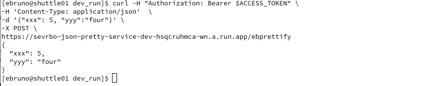

# Deploy a Containerized Service on GCP #

Demostrates skills in designing and implementing infrastructure on GCP using
Terraform, including containerization and basic service deployment.

## Scenario ##

Deploy a simple JSON Prettifier microservice. The task is to
to implement and containerize this simple utility, choose an appropriate GCP
compute platform, provision the necessary infrastructure using Terraform, and
deploy the service securely via an HTTPS endpoint accessible only via authenticated requests.

## Comments ##

I setup three environments which can run in parallel.
main.tf for Dev and QA are same except for settings in 
the variables.tf and outputs.tf.

Prod is the same as QA execept it does not deploy a VM.

## Repository Structure ##
The layout of git repository is shown below:

  - doc : Documentation in pdf and html format.
  - doc_md : Documentation in markdown format.
  - eb_petteyjson : Docker Container definition.
  - environments : The various terraform environments 
  - images : Contains png or other graphics files used in documentation.

## GCP Environment ##
### Google services to be enable ###
The following Google Services/API's must be enabled for the Project.

  - Artifact Registry API
  - Cloud Identity-Aware Proxy API
  - Cloud Run Admin API
  - Compute Engine API
  - IAM Service Account Credentials API
  - Network Management API

## terraform environments ##

  - Production : Deploys the service to GCP that allows VPC access using an access token.
  - Q/A : Deploys the service to GCP that allows VPC access using an access token.
  - dev : Deploys the service to GCP that allows VPC and external access using an access token.
  - local\_dev : Allows the developer to build and test the container on their local machine.
  - all\_in\_one : Allows one of the three enviroments to built by setting the cur_env variable.

On a Intel amd64 machine, use the terraform plans in dev, qa and prod to create the the containter
images in the Google Artifact Registry.

### Development Environment ###
The development environment consists of two directories:
 
  - dev
  - dev\_run
  
  The dev directory builds the container and pushes to the Google Artifact Registry.
  Since the Artifact Registry is flat, the tags are used to identify the correct image
  for the environment. Containers to be used in dev are tagged :\<somekey\>_dev
  
  This Environment deploys the service connected to VPC both the service and VPC are
  configured to allow external traffic for ease of testing for the developers local system.
  Terraform is configured to create the following resources:
  
   - "google\_service\_account" "cloud\_run\_sa"
   - "google\_project\_iam_member" "cloud\_run\_sa\_invoker"
   - "google\_project\_iam_member" "cloud\_run\_sa\_token\_creator"
   - "google\_project\_iam_member" "cloud\_run\_sa\_user"
   - "google\_compute\_network" "vpc\_network"
   - "google\_compute\_subnetwork" "subnet"
   - "google\_project\_service" "vpcaccess"
   - "google\_vpc\_access\_connector" "connector"
   - "google\_cloud\_run\_v2\_service" "default"

The google service account requires the following roles:

   - roles/run.invoker
   - roles/iam.serviceAccountTokenCreator
   - roles/iam.serviceAccountUser

Note:

   -   private\_ip\_google\_access = true
Must be set in google\_compute\_subnetwork used by the VM's.

To support testing a google compute instance is created and attached to the same VPC as the service.
In order to test from the the developers local machine an access token is required.

Generate a JSON Key:

    In the Google Cloud console, go to the "Service accounts" page.
    Select the service account you want to create a key for.
    Go to the "Keys" tab.
    Click "Add key" and select "Create new key".
    Choose "JSON" as the key type and click "Create".
    A JSON file will be downloaded to your computer. 

At this point I have not fould a way from Terrafrom to create an access key and download the key file.
This has to be done from the console. Once you have the key file need to issue the following commands.
Note: The output of the dev environment gives you correct commands to use.
	 
     gcloud auth activate-service-account --key-file=/home/ebruno/Downloads/demo-service-service-43134-f77ae1a0033a.json
     Activated service account credentials for: [cloud-run-demosrv-dev@demo-service-service-43134.iam.gserviceaccount.com]
     export ACCESS_TOKEN=$(gcloud auth print-identity-token --impersonate-service-account=cloud-run-demosrv-dev@demo-service-service-43134.iam.gserviceaccount.com   --audiences=https://demosv-json-pretty-service-dev-hsqcruhmca-wn.a.run.app)
     WARNING: This command is using service account impersonation. All API calls will be executed as [cloud-run-demosrv-dev@demo-service-service-43134.iam.gserviceaccount.com].
     echo $ACCESS_TOKEN

     curl -H "Authorization: Bearer $ACCESS_TOKEN" \
     -H 'Content-Type: application/json'  \
     -d '{"xxx": 5, "yyy":"four"}' \
     -X POST \
      https://demosv-json-pretty-service-dev-hsqcruhmca-wn.a.run.app/ebprettify
    {
      "xxx": 5,
      "yyy": "four"
    }

### QA Environment ###
The development environment consists of two directories:
 
  - qa
  - qa\_run
  
  The qa directory builds the container and pushes to the Google Artifact Registry.
  Since the Artifact Registry is flat, the tags are used to identify the correct image
  for the environment. Containers to be used in dev are tagged :\<somekey\>\_qa
  
  The qa directory builds the container and pushes to the Google Artifact Registry.
  Since the Artifact Registry is flat, the tags are used to indentify the correct image
  for the environment. Containers to be used in dev are tagged :\<somekey\>_qa
  This enviroment deploys the service connected to VPC both the service and VPC 
  configured to restrict external traffic.
  
  Terraform is configured to create the following resources:
  
   - "google\_service\_account" "cloud\_run\_sa"
   - "google\_project\_iam_member" "cloud\_run\_sa\_invoker"
   - "google\_project\_iam_member" "cloud\_run\_sa\_token\_creator"
   - "google\_project\_iam_member" "cloud\_run\_sa\_user"
   - "google\_compute\_network" "vpc\_network"
   - "google\_compute\_subnetwork" "subnet"
   - "google\_project\_service" "vpcaccess"
   - "google\_vpc\_access\_connector" "connector"
   - "google\_cloud\_run\_v2\_service" "default"

Note:

   -   private\_ip\_google\_access = true
Must be set in google\_compute\_subnetwork used by the VM's.

To support testing a google compute instance is created and attached to the same VPC as the service.
In order to test from the the developers local machine an access token is required.

The terraform plan outputs the commands with correct account and email values.

Generate a JSON Key:

    In the Google Cloud console, go to the "Service accounts" page.
    Select the service account you want to create a key for.
    Go to the "Keys" tab.
    Click "Add key" and select "Create new key".
    Choose "JSON" as the key type and click "Create".
    A JSON file will be downloaded to your computer. 

At this point I have not fould a way from Terrafrom to create an access key and download the key file.
This has to be done from the console. Once you have the key file need to issue the following commands.
Note: The output of the dev environment gives you correct commands to use.
	 
     gcloud auth activate-service-account --key-file=/home/ebruno/Downloads/demo-service-service-43134-f77ae1a0033a.json
     Activated service account credentials for: [cloud-run-demosrv-qa@demo-service-service-43134.iam.gserviceaccount.com]
     export ACCESS_TOKEN=$(gcloud auth print-identity-token --impersonate-service-account=cloud-run-demosrv-qa@demo-service-service-43134.iam.gserviceaccount.com   --audiences=https://demosv-json-pretty-service-qa-hsqcruhmca-wn.a.run.app)
     WARNING: This command is using service account impersonation. All API calls will be executed as [cloud-run-demosrv-qa@demo-service-service-43134.iam.gserviceaccount.com].
     echo $ACCESS_TOKEN

     curl -H "Authorization: Bearer $ACCESS_TOKEN" \
     -H 'Content-Type: application/json'  \
     -d '{"xxx": 5, "yyy":"four"}' \
     -X POST \
      https://demosv-json-pretty-service-qa-hsqcruhmca-wn.a.run.app/ebprettify
    {
      "xxx": 5,
      "yyy": "four"
    }
	 
### Production Environment ###
The development enviroment consists of two directories:
 
  - prod
  - prod\_run
  
  The prod directory builds the container and pushes to the Google Artifact Registry.
  Since the Artifact Registry is flat, the tags are used to indentify the correct image
  for the environment. Containers to be used in dev are tagged :\<somekey\>\_prd
  The dev directory builds the container and pushes to the Google Artifact Registry.
  Since the Artifact Registry is flat, the tags are used to indentify the correct image
  for the environment. Containers to be used in dev are tagged :\<somekey\>_dev
  This Enviroment deploys the service connected to VPC both the service and VPC are
  configured to restrict external traffic.
  
  Terraform is configured to create the following resources:
  
   - "google\_service\_account" "cloud\_run\_sa"
   - "google\_project\_iam_member" "cloud\_run\_sa\_invoker"
   - "google\_project\_iam_member" "cloud\_run\_sa\_token\_creator"
   - "google\_project\_iam_member" "cloud\_run\_sa\_user"
   - "google\_compute\_network" "vpc\_network"
   - "google\_compute\_subnetwork" "subnet"
   - "google\_project\_service" "vpcaccess"
   - "google\_vpc\_access\_connector" "connector"
   - "google\_cloud\_run\_v2\_service" "default"

Note:

   -   private\_ip\_google\_access = true
Must be set in google\_compute\_subnetwork used by the VM's that will access the service.

The terraform plan outputs the commands with correct account and email values.

Generate a JSON Key:

    In the Google Cloud console, go to the "Service accounts" page.
    Select the service account you want to create a key for.
    Go to the "Keys" tab.
    Click "Add key" and select "Create new key".
    Choose "JSON" as the key type and click "Create".
    A JSON file will be downloaded to your computer. 

At this point I have not fould a way from Terrafrom to create an access key and download the key file.
This has to be done from the console. Once you have the key file need to issue the following commands.
Note: The output of the dev environment gives you correct commands to use.
	 
     gcloud auth activate-service-account --key-file=/home/ebruno/Downloads/demo-service-service-43134-f77ae1a0033a.json
     Activated service account credentials for: [cloud-run-demosrv-prod@demo-service-service-43134.iam.gserviceaccount.com]
     export ACCESS_TOKEN=$(gcloud auth print-identity-token --impersonate-service-account=cloud-run-demosrv-prod@demo-service-service-43134.iam.gserviceaccount.com   --audiences=https://demosv-json-pretty-service-prod-hsqcruhmca-wn.a.run.app)
     WARNING: This command is using service account impersonation. All API calls will be executed as [cloud-run-demosrv-prod@demo-servicey-service-43134.iam.gserviceaccount.com].
     echo $ACCESS_TOKEN

     curl -H "Authorization: Bearer $ACCESS_TOKEN" \
     -H 'Content-Type: application/json'  \
     -d '{"xxx": 5, "yyy":"four"}' \
     -X POST \
      https://demosv-json-pretty-service-prod-hsqcruhmca-wn.a.run.app/ebprettify
    {
      "xxx": 5,
      "yyy": "four"
    }

### All in One ###

Build anyone of the enviroments by setting the cur_env variable to prod, qa or dev.
This can be done by setting TF\_VAR\cur\_env or

       terraform apply|destroy -var "cur-var=[prod,qa,env]"

outputs will be the same as described above.

## Screen Shots ##

