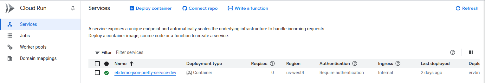

## Deploy a Containerized Service on GCP ##

Demostrates skills in designing and implementing infrastructure on GCP using
Terraform, including containerization and basic service deployment.

### Scenario ###

Deploy a simple JSON Prettifier microservice. The task is to
to implement and containerize this simple utility, choose an appropriate GCP
compute platform, provision the necessary infrastructure using Terraform, and
deploy the service securely via an HTTPS endpoint accessible only via authenticated requests.

### Comments ###
You can only build and deploy one environment at a time based on the cur_env variable.
The two main plans are:

  - build_containers
  - all\_in\_one_run

A default value for cur_env is not specified in either of the above plans.

### Repository Structure ###
The layout of git repository is shown below:

  - clean_repository : Tools for cleaning the cloud artifact repository.
  - doc : Documentation in pdf and html format.
  - doc_md : Documentation in markdown format.
  - eb_petteyjson : Docker Container definition.
  - environments : The various terraform environments
  - images : Contains png or other graphics files used in documentation.
  - list_projects : List projects under the current login.
  - remove_projects : Cleans up and deletes projects.
  - setup_project : Creates a project with required resources and API's enabled.

### Makefile Targets ###
All makefiles support the following targets:

   - sort : If tfsort is installed it will run tfsort on all *.tf files.
   - fmt  : Runs terrafrom fmt against all *.tf files.
   - clean: Removes all editor (emacs, vi, vim) backup files.
   - dist-clean: Calls clean and also removes the .tfstate and .tfstate.backup files and the .terrafrom directory.

### GCP Environment ###
#### Google services to be enable ####
The following Google Services/API's must be enabled for the Project.

  - Artifact Registry API
  - Cloud Identity-Aware Proxy API
  - Cloud Run Admin API
  - Compute Engine API
  - IAM Service Account Credentials API
  - Network Management API

#### Determining Available projects ####
The list_projects terraform module can be used to obtain the list of projects
in a region.  The default region is us-west4.

The project names created with setup\_project create a project
with the prefix "ebdemo-cldrun-srv-"

The repository has a prefix of "ebdemo-service-".

The prefixes are followed by a six digit number that is the same for
the project and repository.

You can get list of active projects and then check the artifact repository with the gcloud command:

	 cd list_projects
	 terrafrom apply
	 Apply complete! Resources: 0 added, 0 changed, 0 destroyed.

	Outputs:

	project_info = [
	  {
	   "lifecyle_state" = "ACTIVE"
	   "name" = "Demo Cloudrun Service"
	   "project" = "ebdemo-cldrun-srv-859707"
	  },
	  {
	   "lifecyle_state" = "ACTIVE"
		"name" = "Demo Cloudrun Service"
		"project" = "ebdemo-cldrun-srv-599248"
	   },
	]
	gcloud artifacts repositories list --project 'ebdemo-cldrun-srv-859707'
	Listing items under project ebdemo-cldrun-srv-859707, across all locations.

																					ARTIFACT_REGISTRY
	REPOSITORY             FORMAT  MODE                 DESCRIPTION                                  LOCATION  LABELS  ENCRYPTION          CREATE_TIME          UPDATE_TIME          SIZE (MB)
	ebdemo-service-859707  DOCKER  STANDARD_REPOSITORY  Artifact Registry for Demo Cloudrun Service  us-west4          Google-managed key  2025-07-22T12:43:15  2025-07-23T16:07:47  0

### terraform environments ###

  - Production : Deploys the service to GCP that allows VPC access using an access token.
  - Q/A : Deploys the service to GCP that allows VPC access using an access token.
  - dev : Deploys the service to GCP that allows VPC and external access using an access token if the variable 'service\_network\_traffic' is set to INGRESS\_TRAFFIC\_ALL.
  - local\_dev : Allows the developer to build and test the container on their local machine using docker.
  - all\_in\_one : Allows one of the three enviroments to built by setting the cur_env variable.

On a Intel amd64 machine, use the terraform plan in build\_container to build
the container for dev, qa or prod.
You need to set the cur_env variable to dev, qa or prod.

#### All in One ####

Build any one of the enviroments by setting the cur_env variable to prod, qa or dev.
This can be done by setting TF\_VAR\_cur\_env or

	   terraform apply|destroy -var "cur_env=[prod,qa,dev]"

It is necessary to define the project\_id and repository\_id variables
either on the command line or in a tfvars file.

#### Building the docker image ####
Use the module build\_container. Set cur\_env, project\_id and repository\_id.

	  terrafrom apply -var "cur_env=[prod,qa,dev]"

Example run:

	  terraform apply -var="cur_env=dev" -var="project_id=ebdemo-cldrun-srv-859707" -var=repository_id=ebdemo-service-859707

	  Terraform used the selected providers to generate the following execution plan. Resource actions are indicated with the following symbols:
		+ create

	   Terraform will perform the following actions:

		 # null_resource.auth_docker will be created
		 + resource "null_resource" "auth_docker" {
			 + id = (known after apply)
		   }

		 # null_resource.build_image will be created
		 + resource "null_resource" "build_image" {
			 + id       = (known after apply)
			 + triggers = {
				 + "dockerfile_sha" = "9f5369d88267093970791d878cf600c14082d33d"
			   }
		   }

		 # null_resource.current_images will be created
		 + resource "null_resource" "current_images" {
			 + id = (known after apply)
		   }

		 # null_resource.push_image will be created
		 + resource "null_resource" "push_image" {
			 + id = (known after apply)
		   }

	   Plan: 4 to add, 0 to change, 0 to destroy.

		 Terraform will perform the actions described above.
		 Only 'yes' will be accepted to approve.

		 Enter a value: yes

	   null_resource.build_image: Creating...
	   null_resource.auth_docker: Creating...
	   null_resource.auth_docker: Provisioning with 'local-exec'...
	   null_resource.auth_docker (local-exec): Executing: ["/bin/sh" "-c" "gcloud auth configure-docker us-west4-docker.pkg.dev"]
	   null_resource.build_image: Provisioning with 'local-exec'...
	   null_resource.build_image (local-exec): Executing: ["/bin/sh" "-c" "docker build -t demo_srv_jp_eb:latest -t us-west4-docker.pkg.dev/ebdemo-cldrun-srv-859707/ebdemo-service-859707/demo_srv_jp_eb:latest_dev  ../../eb_prettyjson"]
	   null_resource.build_image (local-exec): #0 building with "default" instance using docker driver
	   null_resource.build_image (local-exec): #1 [internal] load build definition from Dockerfile
	   null_resource.build_image (local-exec): #1 transferring dockerfile: 305B done
	   null_resource.build_image (local-exec): #1 DONE 0.0s
	   null_resource.build_image (local-exec): #2 [internal] load metadata for docker.io/library/python:3.13-slim-bookworm
	   null_resource.auth_docker (local-exec): WARNING: Your config file at [/home/ebruno/.docker/config.json] contains these credential helper entries:
	   null_resource.auth_docker (local-exec): {
	   null_resource.auth_docker (local-exec):   "credHelpers": {
	   null_resource.auth_docker (local-exec):     "us-west4-docker.pkg.dev": "gcloud"
	   null_resource.auth_docker (local-exec):   }
	   null_resource.auth_docker (local-exec): }
	   null_resource.auth_docker (local-exec): Adding credentials for: us-west4-docker.pkg.dev
	   null_resource.auth_docker (local-exec): gcloud credential helpers already registered correctly.
	   null_resource.auth_docker: Creation complete after 1s [id=3697253587332888311]
	   null_resource.build_image (local-exec): #2 DONE 0.7s
	   null_resource.build_image (local-exec): #3 [internal] load .dockerignore
	   null_resource.build_image (local-exec): #3 transferring context: 2B done
	   null_resource.build_image (local-exec): #3 DONE 0.0s
	   null_resource.build_image (local-exec): #4 [internal] load build context
	   null_resource.build_image (local-exec): #4 transferring context: 148B done
	   null_resource.build_image (local-exec): #4 DONE 0.0s
	   null_resource.build_image (local-exec): #5 [1/5] FROM docker.io/library/python:3.13-slim-bookworm@sha256:4c2cf9917bd1cbacc5e9b07320025bdb7cdf2df7b0ceaccb55e9dd7e30987419
	   null_resource.build_image (local-exec): #5 resolve docker.io/library/python:3.13-slim-bookworm@sha256:4c2cf9917bd1cbacc5e9b07320025bdb7cdf2df7b0ceaccb55e9dd7e30987419 0.0s done
	   null_resource.build_image (local-exec): #5 DONE 0.0s
	   null_resource.build_image (local-exec): #6 [2/5] WORKDIR /app
	   null_resource.build_image (local-exec): #6 CACHED
	   null_resource.build_image (local-exec): #7 [3/5] COPY requirements.txt .
	   null_resource.build_image (local-exec): #7 CACHED
	   null_resource.build_image (local-exec): #8 [4/5] RUN pip install --no-cache-dir -r requirements.txt
	   null_resource.build_image (local-exec): #8 CACHED
	   null_resource.build_image (local-exec): #9 [5/5] COPY . .
	   null_resource.build_image (local-exec): #9 CACHED
	   null_resource.build_image (local-exec): #10 exporting to image
	   null_resource.build_image (local-exec): #10 exporting layers done
	   null_resource.build_image (local-exec): #10 writing image sha256:694b253e2b7177b94bf4e1d81d109799989e56194a67cc5b755972d43e9e7bc3 done
	   null_resource.build_image (local-exec): #10 naming to docker.io/library/demo_srv_jp_eb:latest done
	   null_resource.build_image (local-exec): #10 naming to us-west4-docker.pkg.dev/ebdemo-cldrun-srv-859707/ebdemo-service-859707/demo_srv_jp_eb:latest_dev done
	   null_resource.build_image (local-exec): #10 DONE 0.0s
	   null_resource.build_image: Creation complete after 1s [id=2052024071720223877]
	   null_resource.push_image: Creating...
	   null_resource.push_image: Provisioning with 'local-exec'...
	   null_resource.push_image (local-exec): Executing: ["/bin/sh" "-c" "docker push us-west4-docker.pkg.dev/ebdemo-cldrun-srv-859707/ebdemo-service-859707/demo_srv_jp_eb:latest_dev"]
	   null_resource.push_image (local-exec): The push refers to repository [us-west4-docker.pkg.dev/ebdemo-cldrun-srv-859707/ebdemo-service-859707/demo_srv_jp_eb]
	   null_resource.push_image (local-exec): f09f76244057: Preparing
	   null_resource.push_image (local-exec): 9f83d155a0c7: Preparing
	   null_resource.push_image (local-exec): 6d423f184e68: Preparing
	   null_resource.push_image (local-exec): 3b15e11a3e5f: Preparing
	   null_resource.push_image (local-exec): 7d8e4ce94100: Preparing
	   null_resource.push_image (local-exec): 547f1fc1a2bb: Preparing
	   null_resource.push_image (local-exec): 9621f68f1f5d: Preparing
	   null_resource.push_image (local-exec): 7cc7fe68eff6: Preparing
	   null_resource.push_image (local-exec): 9621f68f1f5d: Waiting
	   null_resource.push_image (local-exec): 547f1fc1a2bb: Waiting
	   null_resource.push_image (local-exec): 7cc7fe68eff6: Waiting
	   null_resource.push_image (local-exec): 7d8e4ce94100: Pushed
	   null_resource.push_image (local-exec): 6d423f184e68: Pushed
	   null_resource.push_image (local-exec): 3b15e11a3e5f: Pushed
	   null_resource.push_image (local-exec): f09f76244057: Pushed
	   null_resource.push_image (local-exec): 9f83d155a0c7: Pushed
	   null_resource.push_image (local-exec): 9621f68f1f5d: Pushed
	   null_resource.push_image (local-exec): 547f1fc1a2bb: Pushed
	   null_resource.push_image: Still creating... [00m10s elapsed]
	   null_resource.push_image (local-exec): 7cc7fe68eff6: Pushed
	   null_resource.push_image (local-exec): latest_dev: digest: sha256:458a108abb7615970908d8594c98462f1cbd75ff2cda77c074a1dbe2ff73ea67 size: 1991
	   null_resource.push_image: Creation complete after 18s [id=6315681113482531790]
	   null_resource.current_images: Creating...
	   null_resource.current_images: Provisioning with 'local-exec'...
	   null_resource.current_images (local-exec): Executing: ["/bin/sh" "-c" "docker rmi demo_srv_jp_eb:latest us-west4-docker.pkg.dev/ebdemo-cldrun-srv-859707/ebdemo-service-859707/demo_srv_jp_eb:latest_dev"]
	   null_resource.current_images (local-exec): Untagged: demo_srv_jp_eb:latest
	   null_resource.current_images (local-exec): Untagged: us-west4-docker.pkg.dev/ebdemo-cldrun-srv-859707/ebdemo-service-859707/demo_srv_jp_eb:latest_dev
	   null_resource.current_images (local-exec): Untagged: us-west4-docker.pkg.dev/ebdemo-cldrun-srv-859707/ebdemo-service-859707/demo_srv_jp_eb@sha256:458a108abb7615970908d8594c98462f1cbd75ff2cda77c074a1dbe2ff73ea67
	   null_resource.current_images: Creation complete after 0s [id=3363992505643839893]

Before you can run the apply again with a different cur_env, you need to do destroy.

	  terrafrom destroy -var "cur_env=[prod,qa,dev]"

Sample run:

	  terraform destory -var="cur_env=dev" -var="project_id=ebdemo-cldrun-srv-859707" -var=repository_id=ebdemo-service-859707
	  build_container$ terraform destroy -var="cur_env=dev" -var="project_id=ebdemo-cldrun-srv-859707" -var=repository_id=ebdemo-service-859707
	  null_resource.build_image: Refreshing state... [id=2052024071720223877]
	  null_resource.auth_docker: Refreshing state... [id=3697253587332888311]
	  null_resource.push_image: Refreshing state... [id=6315681113482531790]
	  null_resource.current_images: Refreshing state... [id=3363992505643839893]

	  Terraform used the selected providers to generate the following execution plan. Resource actions are indicated with the following symbols:
		- destroy

	  Terraform will perform the following actions:

		# null_resource.auth_docker will be destroyed
		- resource "null_resource" "auth_docker" {
			- id = "3697253587332888311" -> null
		  }

		# null_resource.build_image will be destroyed
		- resource "null_resource" "build_image" {
			- id       = "2052024071720223877" -> null
			- triggers = {
				- "dockerfile_sha" = "9f5369d88267093970791d878cf600c14082d33d"
			  } -> null
		  }

		# null_resource.current_images will be destroyed
		- resource "null_resource" "current_images" {
			- id = "3363992505643839893" -> null
		  }

		# null_resource.push_image will be destroyed
		- resource "null_resource" "push_image" {
			- id = "6315681113482531790" -> null
		  }

	  Plan: 0 to add, 0 to change, 4 to destroy.

	  null_resource.current_images: Destroying... [id=3363992505643839893]
	  null_resource.current_images: Destruction complete after 0s
	  null_resource.push_image: Destroying... [id=6315681113482531790]
	  null_resource.push_image: Destruction complete after 0s
	  null_resource.auth_docker: Destroying... [id=3697253587332888311]
	  null_resource.build_image: Destroying... [id=2052024071720223877]
	  null_resource.auth_docker: Destruction complete after 0s
	  null_resource.build_image: Destruction complete after 0s

	  Destroy complete! Resources: 4 destroyed.

#### Development Environment ####
The development environment consists of two directories:
Use build\_container and all\_in\_one\_run with cur\_env set to dev

build\_container builds the container and pushes to the Google Artifact Registry.
Since the Artifact Registry is flat, the tags are used to identify the correct image
for the environment. Containers to be used in dev are tagged :\<somekey\>_dev

This Environment deploys the service connected to VPC both the service and VPC are
configured to allow external traffic for ease of testing for the developer's local system,
if the variable 'service\_network\_traffic' is set to INGRESS\_TRAFFIC\_ALL.

Terraform is configured to create the following resources:

   - "google\_service\_account" "cloud\_run\_sa"
   - "google\_project\_iam_member" "cloud\_run\_sa\_invoker"
   - "google\_project\_iam_memer" "cloud\_run\_sa\_token\_creator"
   - "google\_project\_iam_member" "cloud\_run\_sa\_user"
   - "google\_compute\_network" "vpc\_network"
   - "google\_compute\_subnetwork" "subnet"
   - "google\_project\_service" "vpcaccess"
   - "google\_vpc\_access\_connector" "connector"
   - "google\_cloud\_run\_v2\_service" "default"

The google service account requires the following roles:

   - roles/run.invoker
   - roles/iam.serviceAccountTokenCreator
   - roles/iam.serviceAccountUser

Note:

   -   private\_ip\_google\_access = true
Must be set in google\_compute\_subnetwork used by the VM's.

To support testing a google compute instance is created and attached to the same VPC as the service.
In order to test from the compute instance or developer's local machine an access token is required.

Generate a JSON Key:

	In the Google Cloud console, go to the "Service accounts" page.
	Select the service account you want to create a key for.
	Go to the "Keys" tab.
	Click "Add key" and select "Create new key".
	Choose "JSON" as the key type and click "Create".
	A JSON file will be downloaded to your computer.

or use the cli.

	 gcloud iam service-accounts keys create ../tmp/cloud-run-demosrv-dev-859707-949583750102.json --iam-account=cloud-run-demosrv-dev@ebdemo-cldrun-srv-859707.iam.gserviceaccount.com

Note: The output of the dev environment gives you correct commands to use.

	 gcloud auth activate-service-account --key-file=<your home dir>/Downloads/ebdemo-service-service-859707-f77ae1a0033a.json
	 Activated service account credentials for: [cloud-run-demosrv-dev@ebdemo-service-service-859707.iam.gserviceaccount.com]
	 export ACCESS_TOKEN=$(gcloud auth print-identity-token --impersonate-service-account=cloud-run-demosrv-dev@ebdemo-service-service-859707.iam.gserviceaccount.com   --audiences=https://demosv-json-pretty-service-dev-hsqcruhmca-wn.a.run.app)
	 WARNING: This command is a using service account impersonation. All API calls will be executed as [cloud-run-demosrv-dev@ebdemo-service-service-859707.iam.gserviceaccount.com].

The ACCESS\_TOKEN will need to be installed on the test VM.

	 curl -H "Authorization: Bearer $ACCESS_TOKEN" \
	 -H 'Content-Type: application/json'  \
	 -d '{"xxx": 5, "yyy":"four"}' \
	 -X POST \
	  https://demosv-json-pretty-service-dev-hsqcruhmca-wn.a.run.app/ebprettify
	{
	  "xxx": 5,
	  "yyy": "four"
	}

You will need to copy the access token to the test VM.
You can either use gcloud to access the VM via ssh or use web console ssh access.

#### QA Environment ####
The Q/A environment consists of two directories:
Use build\_container and all\_in\_one\_run with cur\_env set to qa.
The build_container plan builds the container and pushes to the Google Artifact Registry.

Since the Artifact Registry is flat, the tags are used to identify the correct image
for the environment. Containers to be used in qa are tagged :\<somekey\>\_qa.

See the section [Building the docker image](#building-the-docker-image)

This enviroment deploys the service connected to VPC both the service and VPC
configured to restrict external traffic.

Terraform is configured to create the following resources:

   - "google\_service\_account" "cloud\_run\_sa"
   - "google\_project\_iam_member" "cloud\_run\_sa\_invoker"
   - "google\_project\_iam_member" "cloud\_run\_sa\_token\_creator"
   - "google\_project\_iam_member" "cloud\_run\_sa\_user"
   - "google\_compute\_network" "vpc\_network"
   - "google\_compute\_subnetwork" "subnet"
   - "google\_project\_service" "vpcaccess"
   - "google\_vpc\_access\_connector" "connector"
   - "google\_cloud\_run\_v2\_service" "default"

Note:

   -   private\_ip\_google\_access = true
Must be set in google\_compute\_subnetwork used by the VM's.

To support testing a google compute instance is created and attached to the same VPC as the service.
In order to test from the compute instance an access token is required.

The terraform plan outputs the commands with the correct account and email values.

Generate a JSON Key:

	In the Google Cloud console, go to the "Service accounts" page.
	Select the service account you want to create a key for.
	Go to the "Keys" tab.
	Click "Add key" and select "Create new key".
	Choose "JSON" as the key type and click "Create".
	A JSON file will be downloaded to your computer.

or use the cli.

	 gcloud iam service-accounts keys create ../tmp/cloud-run-demosrv-dev-859707-949583750102.json --iam-account=cloud-run-demosrv-dev@ebdemo-cldrun-srv-859707.iam.gserviceaccount.com

Note: The output of the dev environment gives you correct commands to use.

	 gcloud auth activate-service-account --key-file=<your home dir>/Downloads/ebdemo-service-service-859707-f77ae1a0033a.json
	 Activated service account credentials for: [cloud-run-demosrv-qa@ebdemo-service-service-859707.iam.gserviceaccount.com]
	 export ACCESS_TOKEN=$(gcloud auth print-identity-token --impersonate-service-account=cloud-run-demosrv-qa@ebdemo-service-service-859707.iam.gserviceaccount.com   --audiences=https://demosv-json-pretty-service-qa-hsqcruhmca-wn.a.run.app)
	 WARNING: This command is using service account impersonation. All API calls will be executed as [cloud-run-demosrv-qa@ebdemo-service-service-859707.iam.gserviceaccount.com].

The ACCESS\_TOKEN will need to be installed on the test VM.

	 curl -H "Authorization: Bearer $ACCESS_TOKEN" \
	 -H 'Content-Type: application/json'  \
	 -d '{"xxx": 5, "yyy":"four"}' \
	 -X POST \
	  https://demosv-json-pretty-service-qa-hsqcruhmca-wn.a.run.app/ebprettify
	{
	  "xxx": 5,
	  "yyy": "four"
	}

#### Production Environment ####
The production enviroment consists of two directories:
Use build_container and all\_in\_one\_run with cur\_env set to prod

See the section [Building the docker image](#building-the-docker-image)

build\_container builds the container and pushes to the Google Artifact Registry.
Since the Artifact Registry is flat, the tags are used to indentify the correct image
for the environment. Containers to be used in prod are tagged :\<somekey\>\_prod.

Since the Artifact Registry is flat, the tags are used to indentify the correct image
for the environment. Containers to be used in prod are tagged :\<somekey\>_prod.
This Enviroment deploys the service connected to VPC both the service and VPC are
configured to restrict external traffic.

Terraform is configured to create the following resources:

   - "google\_service\_account" "cloud\_run\_sa"
   - "google\_project\_iam_member" "cloud\_run\_sa\_invoker"
   - "google\_project\_iam_member" "cloud\_run\_sa\_token\_creator"
   - "google\_project\_iam_member" "cloud\_run\_sa\_user"
   - "google\_compute\_network" "vpc\_network"
   - "google\_compute\_subnetwork" "subnet"
   - "google\_project\_service" "vpcaccess"
   - "google\_vpc\_access\_connector" "connector"
   - "google\_cloud\_run\_v2\_service" "default"

Note:

   -   private\_ip\_google\_access = true
Must be set in google\_compute\_subnetwork used by the VM's that will access the service.

The terraform plan outputs the commands with correct account and email values.

Generate a JSON Key:

	In the Google Cloud console, go to the "Service accounts" page.
	Select the service account you want to create a key for.
	Go to the "Keys" tab.
	Click "Add key" and select "Create new key".
	Choose "JSON" as the key type and click "Create".
	A JSON file will be downloaded to your computer.

or use the cli.

	 gcloud iam service-accounts keys create ../tmp/cloud-run-demosrv-dev-859707-949583750102.json --iam-account=cloud-run-demosrv-dev@ebdemo-cldrun-srv-859707.iam.gserviceaccount.com

Note: The output of the dev environment gives you correct commands to use.

	 gcloud auth activate-service-account --key-file=<your home dir>/Downloads/ebdemo-service-service-859707-f77ae1a0033a.json
	 Activated service account credentials for: [cloud-run-demosrv-prod@ebdemo-service-service-859707.iam.gserviceaccount.com]
	 export ACCESS_TOKEN=$(gcloud auth print-identity-token --impersonate-service-account=cloud-run-demosrv-prod@ebdemo-service-service-859707.iam.gserviceaccount.com   --audiences=https://demosv-json-pretty-service-prod-hsqcruhmca-wn.a.run.app)
	 WARNING: This command is using service account impersonation. All API calls will be executed as [cloud-run-demosrv-prod@ebdemo-service-service-859707.iam.gserviceaccount.com].
	 The resouce that will access the service will need an access token.

	 curl -H "Authorization: Bearer $ACCESS_TOKEN" \
	 -H 'Content-Type: application/json'  \
	 -d '{"xxx": 5, "yyy":"four"}' \
	 -X POST \
	  https://demosv-json-pretty-service-prod-hsqcruhmca-wn.a.run.app/ebprettify
	{
	  "xxx": 5,
	  "yyy": "four"
	}

### Screen Shots ###

